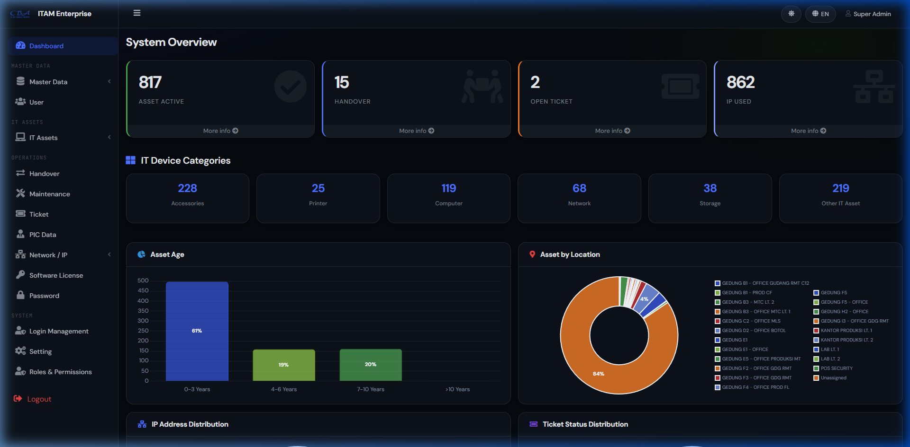
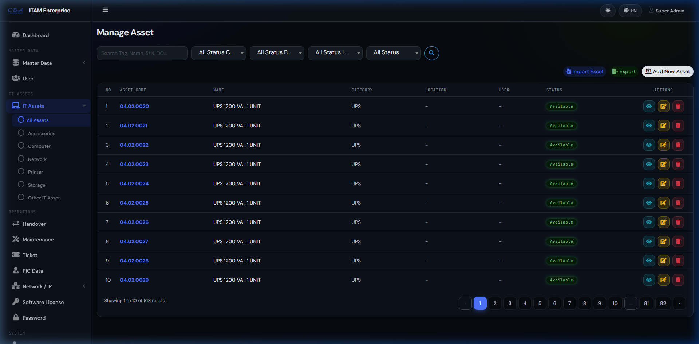
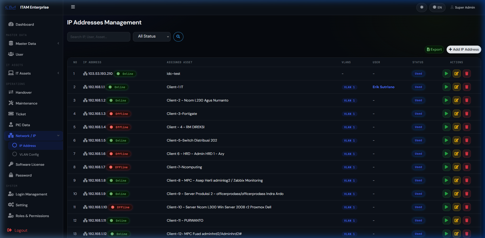
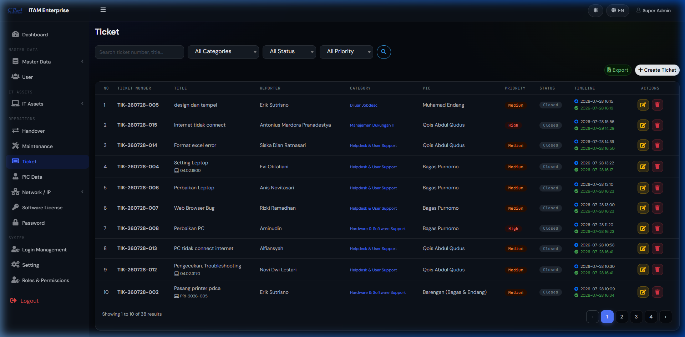
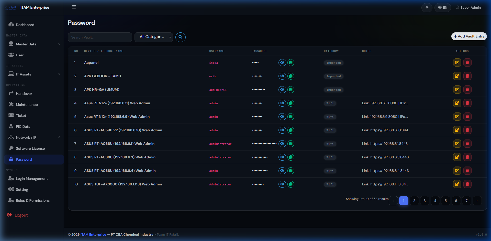

# IT Asset Management (ITAM) Enterprise

Aplikasi Sistem Manajemen Aset IT dan Helpdesk yang komprehensif, dibangun menggunakan framework Laravel 12. Aplikasi ini membantu perusahaan dan departemen IT dalam melacak, mengelola, dan mengoptimalkan aset IT, sumber daya jaringan, serta operasional layanan dukungan teknis (helpdesk).

---

## 📸 Tangkapan Layar (Screenshots Fitur)

### 1. Dashboard Analytics & Summary
Menampilkan ringkasan statistik aset, lisensi, tiket aktif, serta grafik distribusi status secara real-time.


---

### 2. Manajemen Siklus Hidup Aset (IT Asset Management)
Melacak inventaris aset IT lengkap dengan tag aset, serial number, lokasi, kategori, peminjaman (checkout/checkin), serta QR Code label.


---

### 3. Manajemen Jaringan & IP Address (Ping & Auto-Gateway)
Mengelola segmen VLAN dan Alamat IP secara terstruktur, dilengkapi dengan fitur manual *Ping Test* serta penetapan gateway otomatis (`192.168.X.254`).


---

### 4. Helpdesk & Ticketing System
Sistem pelaporan gangguan IT dengan template otomatis, PIC penanggung jawab, prioritas, serta pelacakan timeline penyelesaian tiket.


---

### 5. Password Vault (Brankas Kredensial Aman)
Penyimpanan kredensial server, aplikasi, dan jaringan secara aman yang dilengkapi dengan fitur *show/hide password* dan *one-click copy to clipboard*.


---

## 🚀 Fitur Utama

- **Manajemen Hak Akses (RBAC):** Keamanan akses berbasis peran pengguna (Super Admin, Admin, dan User).
- **Manajemen Data Master:** Kemudahan dalam mengelola data Departemen, Vendor, Merk (Brand), Lokasi, Kategori Aset, Karyawan, serta Master Data PIC IT.
- **Manajemen Siklus Hidup Aset:** Melacak aset mulai dari pengadaan hingga pembuangan (*disposal*). Proses peminjaman (*checkout*) dan pengembalian (*checkin*) aset kepada karyawan, serta pembuatan label aset (QR Code).
- **Manajemen Jaringan:** Mengelola VLAN dan Alamat IP secara terstruktur, dilengkapi fitur manual *ping test* serta alokasi gateway otomatis per VLAN.
- **Lisensi & Kredensial:** Menyimpan dan mengelola Lisensi Software serta *Password Vault* (Brankas Password) dengan aman.
- **Helpdesk & Ticketing:** Sistem tiket pelaporan gangguan IT yang dilengkapi kategori sesuai jobdesk, PIC penanggung jawab, template otomatis untuk judul pelaporan, serta pelacakan timeline (*SLA & resolution time*).
- **Import & Export Data:** Mendukung Import dan Export data massal menggunakan file Excel (.xlsx, .xls, .csv) dengan modal UI responsif untuk mobile.
- **Multi-Bahasa & Tema Modern:** Mendukung peralihan bahasa (Inggris/Indonesia) dan tema modern dengan Mode Gelap (*Dark Mode*) / Mode Terang (*Light Mode*).

---

## 🛠️ Teknologi yang Digunakan

- **Backend Framework:** Laravel 12
- **Autentikasi & Otorisasi:** Laravel Breeze, Spatie Laravel Permission
- **Export/Import Excel:** Maatwebsite Excel
- **Frontend & UI:** Bootstrap 4, AdminLTE 3 (Customized Modern Theme), Vanilla CSS, Flatpickr, SweetAlert2

---

## 💻 Panduan Instalasi

1. Clone repositori ini ke komputer Anda:
   ```bash
   git clone https://github.com/doelkussoy/itam.git
   cd itam
   ```
2. Install dependensi PHP:
   ```bash
   composer install
   ```
3. Install dependensi Frontend:
   ```bash
   npm install
   ```
4. Salin file konfigurasi `.env.example` menjadi `.env` dan sesuaikan pengaturan database:
   ```bash
   cp .env.example .env
   ```
5. Generate *application key*:
   ```bash
   php artisan key:generate
   ```
6. Jalankan migrasi database (beserta seeder jika diperlukan):
   ```bash
   php artisan migrate --seed
   ```
7. Build aset frontend:
   ```bash
   npm run build
   ```
8. Jalankan *development server*:
   ```bash
   php artisan serve
   ```
   *Catatan: Anda juga dapat menggunakan perintah `composer run dev` untuk menjalankan `php artisan serve`, queue worker, dan `npm run dev` secara bersamaan.*

---

## 📄 Lisensi

Proyek ini adalah perangkat lunak *open-source* di bawah lisensi [MIT License](https://opensource.org/licenses/MIT).
